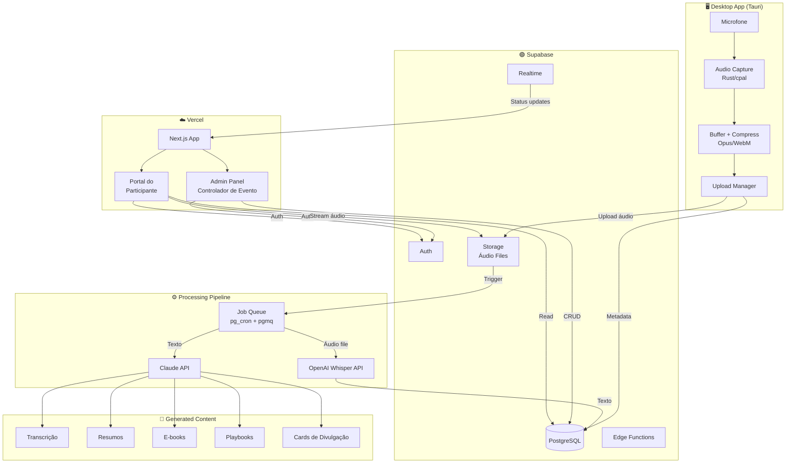
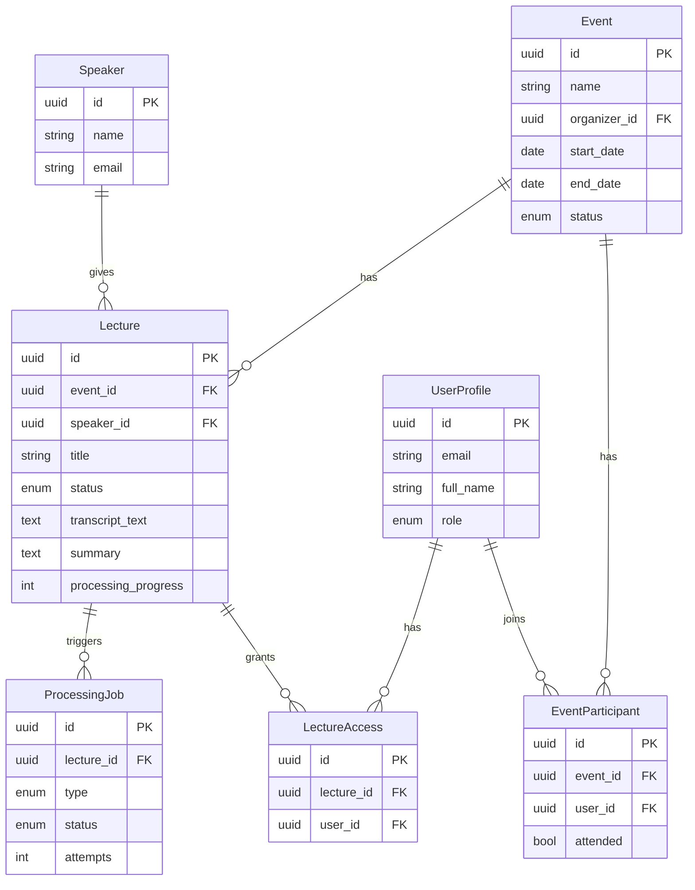
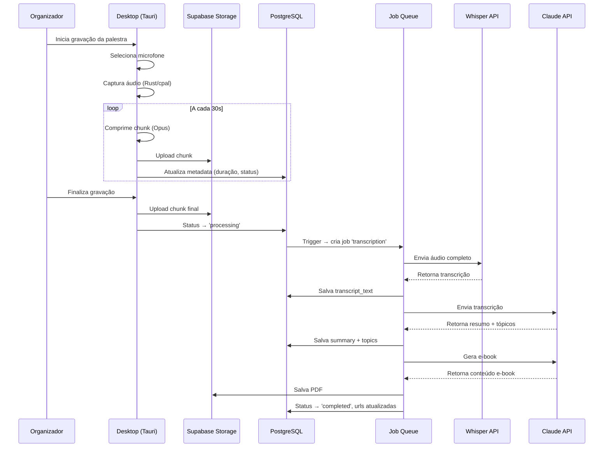
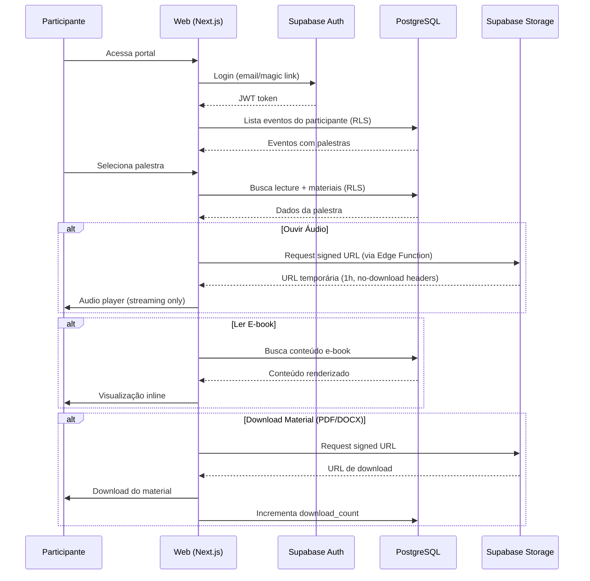
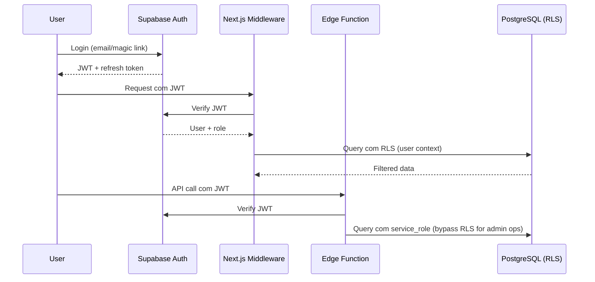

 # ScribIA — Fullstack Architecture Document

## 1. Introduction

Este documento define a arquitetura completa do **ScribIA**, um sistema que capta áudio de palestras em tempo real, transcreve automaticamente, e gera conteúdo derivado (e-books, playbooks, resumos) para participantes de eventos.

**Starter Template:** N/A — Greenfield project

| Date | Version | Description | Author |
|------|---------|-------------|--------|
| 2026-03-18 | 0.1.0 | Initial architecture | Aria (Architect) |

---

## 2. High Level Architecture

### 2.1 Technical Summary

O ScribIA adota uma arquitetura **híbrida**: um app desktop nativo (Tauri + React) para captação de áudio, combinado com uma plataforma web (Next.js) para administração e portal do participante. O backend é serverless via **Supabase** (PostgreSQL + Auth + Storage + Edge Functions), com processamento assíncrono de áudio via fila de jobs. A transcrição usa **OpenAI Whisper API**, e a geração de conteúdo (e-books, playbooks, resumos) usa **Claude API**. Deploy na **Vercel** (web) com Supabase como BaaS.

### 2.2 Platform and Infrastructure

**Platform:** Vercel + Supabase
**Key Services:**
- **Supabase:** PostgreSQL, Auth, Storage (áudio), Edge Functions, Realtime
- **Vercel:** Hosting Next.js, Edge/Serverless Functions
- **OpenAI API:** Whisper (transcrição de áudio)
- **Anthropic API:** Claude (geração de conteúdo)

**Deployment Regions:** São Paulo (sa-east-1) — primary

### 2.3 Repository Structure

**Structure:** Monorepo
**Monorepo Tool:** npm workspaces (Turborepo para builds)
**Package Organization:**

```
scribia/
├── apps/
│   ├── desktop/          # Tauri app (captação de áudio)
│   ├── web/              # Next.js (admin + portal participante)
│   └── worker/           # Background jobs (transcrição + geração)
├── packages/
│   ├── shared/           # Types, constants, utils compartilhados
│   ├── ui/               # Componentes UI compartilhados (React)
│   └── supabase/         # Client Supabase, queries, types gerados
└── supabase/             # Migrations, seed, edge functions
```

### 2.4 High Level Architecture Diagram



### 2.5 Architectural Patterns

- **BaaS-First (Backend as a Service):** Supabase como backend principal, minimizando código server-side custom — _Rationale:_ Acelera desenvolvimento, reduz infra a gerenciar
- **Event-Driven Processing:** Upload de áudio dispara pipeline assíncrona de processamento — _Rationale:_ Transcrição e geração de conteúdo são operações longas (minutos), não podem bloquear o UX
- **Component-Based UI:** React components compartilhados entre Desktop (Tauri) e Web (Next.js) via package `ui/` — _Rationale:_ Reuso de código, consistência visual
- **Row Level Security (RLS):** Controle de acesso a nível de banco de dados — _Rationale:_ Participantes só veem eventos/palestras que participaram
- **Streaming Audio:** Áudio servido via signed URLs do Supabase Storage, sem download direto — _Rationale:_ Requisito de negócio: ouvir sim, baixar não

---

## 3. Tech Stack

| Category | Technology | Version | Purpose | Rationale |
|----------|-----------|---------|---------|-----------|
| Desktop Runtime | Tauri | 2.x | App desktop nativo | Leve (~10MB), Rust backend para áudio, cross-platform |
| Desktop Audio | cpal (Rust) | latest | Captura de áudio nativa | Acesso direto ao hardware de áudio, baixa latência |
| Frontend Language | TypeScript | 5.x | Tipagem estática | Segurança de tipos, DX, compartilhamento de types |
| Frontend Framework | Next.js | 15.x | Web app (admin + portal) | SSR, App Router, API Routes, Vercel-native |
| UI Components | shadcn/ui | latest | Componentes base | Customizável, acessível, sem vendor lock-in |
| Styling | Tailwind CSS | 4.x | Estilização | Utility-first, performance, consistência |
| State Management | Zustand | 5.x | Estado global (desktop) | Leve, simples, sem boilerplate |
| Server State | TanStack Query | 5.x | Cache e sync de dados server | Deduplication, cache, revalidation automática |
| Backend/BaaS | Supabase | latest | Auth, DB, Storage, Functions | PostgreSQL nativo, Auth integrado, Storage com RLS |
| Database | PostgreSQL | 15+ | Dados relacionais | Via Supabase, robusto, RLS, extensões (pgvector) |
| Job Queue | pgmq + pg_cron | latest | Fila de processamento | Nativo no PostgreSQL, sem infra adicional |
| File Storage | Supabase Storage | latest | Armazenamento de áudio | S3-compatible, signed URLs, RLS |
| Authentication | Supabase Auth | latest | Login/registro | Email, Magic Link, OAuth, JWT |
| Transcription API | OpenAI Whisper | latest | Áudio → Texto | Melhor accuracy pt-BR, API simples |
| Content Generation | Claude API | claude-sonnet-4-6 | Texto → E-books/Playbooks | Superior em geração longa, nuance em pt-BR |
| Audio Format | Opus/WebM | - | Compressão de áudio | Excelente compressão, qualidade para voz |
| Frontend Testing | Vitest | 2.x | Unit tests | Compatível com Vite, rápido |
| E2E Testing | Playwright | latest | Testes end-to-end | Cross-browser, confiável |
| Build Tool | Turborepo | 2.x | Monorepo builds | Cache, parallel builds, incremental |
| CI/CD | GitHub Actions | - | Pipeline CI/CD | Integração nativa com GitHub |
| Hosting Web | Vercel | - | Deploy Next.js | Edge network, preview deploys, integração Next.js |
| Monitoring | Sentry | latest | Error tracking | Frontend + Backend, source maps |
| PDF Generation | @react-pdf/renderer | latest | E-books e materiais PDF | React-based, server-side rendering |
| DOCX Generation | docx | latest | Documentos editáveis | Geração programática de DOCX |

---

## 4. Data Models

### 4.1 Event (Evento)

**Purpose:** Representa um evento (congresso, conferência, etc.)

```typescript
interface Event {
  id: string;                  // uuid
  name: string;
  description: string | null;
  organizer_id: string;        // FK → User
  start_date: string;          // ISO date
  end_date: string;            // ISO date
  location: string | null;
  cover_image_url: string | null;
  status: 'draft' | 'active' | 'completed' | 'archived';
  created_at: string;
  updated_at: string;
}
```

**Relationships:** Has many Lectures, has many Participants (via EventParticipant)

### 4.2 Lecture (Palestra)

**Purpose:** Uma palestra dentro de um evento

```typescript
interface Lecture {
  id: string;                  // uuid
  event_id: string;            // FK → Event
  speaker_id: string;          // FK → Speaker
  title: string;
  description: string | null;
  scheduled_at: string;        // ISO datetime
  duration_minutes: number | null;
  status: 'scheduled' | 'recording' | 'processing' | 'completed' | 'failed';
  audio_url: string | null;    // Supabase Storage path
  audio_duration_seconds: number | null;
  transcript_text: string | null;
  summary: string | null;
  topics: string[];            // Segmentação por tópicos
  ebook_url: string | null;    // Generated PDF path
  playbook_url: string | null; // Generated playbook path
  card_image_url: string | null; // Card de divulgação
  processing_progress: number; // 0-100
  created_at: string;
  updated_at: string;
}
```

**Relationships:** Belongs to Event, belongs to Speaker, has many LectureSegments

### 4.3 Speaker (Palestrante)

**Purpose:** Palestrante de uma ou mais palestras

```typescript
interface Speaker {
  id: string;                  // uuid
  name: string;
  email: string | null;
  bio: string | null;
  avatar_url: string | null;
  company: string | null;
  role: string | null;
  created_at: string;
}
```

**Relationships:** Has many Lectures

### 4.4 User (Participante/Organizador)

**Purpose:** Usuário do sistema (participante ou organizador)

```typescript
interface UserProfile {
  id: string;                  // uuid (= auth.users.id)
  email: string;
  full_name: string;
  role: 'organizer' | 'participant';
  avatar_url: string | null;
  created_at: string;
  updated_at: string;
}
```

### 4.5 EventParticipant

**Purpose:** Relação N:N entre Event e User

```typescript
interface EventParticipant {
  id: string;
  event_id: string;            // FK → Event
  user_id: string;             // FK → UserProfile
  registered_at: string;
  attended: boolean;
}
```

### 4.6 LectureAccess (Acesso do Participante)

**Purpose:** Controla quais palestras o participante pode acessar

```typescript
interface LectureAccess {
  id: string;
  lecture_id: string;          // FK → Lecture
  user_id: string;             // FK → UserProfile
  accessed_at: string | null;
  download_count: number;      // Track downloads de materiais (não áudio)
}
```

### 4.7 ProcessingJob

**Purpose:** Fila de processamento (transcrição, geração de conteúdo)

```typescript
interface ProcessingJob {
  id: string;
  lecture_id: string;          // FK → Lecture
  type: 'transcription' | 'summary' | 'ebook' | 'playbook' | 'card';
  status: 'queued' | 'processing' | 'completed' | 'failed';
  attempts: number;
  error_message: string | null;
  started_at: string | null;
  completed_at: string | null;
  created_at: string;
}
```

### Entity Relationship Diagram



---

## 5. API Specification

O ScribIA usa **Supabase Client SDK** como camada principal de acesso a dados (auto-generated REST + RLS), complementado por **Edge Functions** para lógica complexa.

### 5.1 Supabase Edge Functions (Custom APIs)

```yaml
# POST /functions/v1/upload-audio
# Recebe chunk de áudio e armazena no Storage
upload-audio:
  method: POST
  auth: required (JWT)
  body:
    lecture_id: uuid
    chunk_index: number
    audio_data: binary (multipart)
  response: { success: boolean, chunk_id: string }

# POST /functions/v1/process-lecture
# Dispara pipeline de processamento
process-lecture:
  method: POST
  auth: required (organizer only)
  body:
    lecture_id: uuid
    options:
      generate_transcript: boolean
      generate_summary: boolean
      generate_ebook: boolean
      generate_playbook: boolean
      generate_card: boolean
  response: { job_ids: string[] }

# POST /functions/v1/finalize-audio
# Combina chunks em arquivo final e inicia processamento
finalize-audio:
  method: POST
  auth: required (JWT)
  body:
    lecture_id: uuid
  response: { audio_url: string, processing_started: boolean }

# GET /functions/v1/audio-stream/:lecture_id
# Retorna signed URL temporária para streaming (sem download)
audio-stream:
  method: GET
  auth: required (participant with access)
  params:
    lecture_id: uuid
  response: { signed_url: string, expires_in: 3600 }

# POST /functions/v1/generate-materials
# Gera PDF, DOCX a partir de conteúdo processado
generate-materials:
  method: POST
  auth: required (organizer only)
  body:
    lecture_id: uuid
    formats: ['pdf', 'docx']
  response: { urls: { pdf?: string, docx?: string } }

# GET /functions/v1/event-analytics/:event_id
# Retorna analytics consolidados do evento
event-analytics:
  method: GET
  auth: required (organizer only)
  params:
    event_id: uuid
  response:
    total_lectures: number
    total_audios_converted: number
    total_ebooks_generated: number
    download_rate: number
    participant_engagement: object
```

### 5.2 Supabase Auto-Generated (via Client SDK)

Todas as operações CRUD padrão são feitas diretamente pelo Supabase Client SDK com RLS:

```typescript
// Exemplos de uso direto (protegido por RLS)
supabase.from('events').select('*')
supabase.from('lectures').select('*, speaker:speakers(*)')
supabase.from('event_participants').insert({ event_id, user_id })
```

---

## 6. Core Workflows

### 6.1 Fluxo de Captação e Processamento de Áudio



### 6.2 Fluxo do Participante



---

## 7. Database Schema

```sql
-- Enable necessary extensions
CREATE EXTENSION IF NOT EXISTS "uuid-ossp";
CREATE EXTENSION IF NOT EXISTS "pgmq";

-- ============================================
-- USERS / PROFILES
-- ============================================
CREATE TABLE public.user_profiles (
    id UUID PRIMARY KEY REFERENCES auth.users(id) ON DELETE CASCADE,
    email TEXT NOT NULL,
    full_name TEXT NOT NULL,
    role TEXT NOT NULL CHECK (role IN ('organizer', 'participant')) DEFAULT 'participant',
    avatar_url TEXT,
    created_at TIMESTAMPTZ DEFAULT now(),
    updated_at TIMESTAMPTZ DEFAULT now()
);

-- ============================================
-- EVENTS
-- ============================================
CREATE TABLE public.events (
    id UUID PRIMARY KEY DEFAULT uuid_generate_v4(),
    name TEXT NOT NULL,
    description TEXT,
    organizer_id UUID NOT NULL REFERENCES public.user_profiles(id),
    start_date DATE NOT NULL,
    end_date DATE NOT NULL,
    location TEXT,
    cover_image_url TEXT,
    status TEXT NOT NULL CHECK (status IN ('draft', 'active', 'completed', 'archived')) DEFAULT 'draft',
    created_at TIMESTAMPTZ DEFAULT now(),
    updated_at TIMESTAMPTZ DEFAULT now()
);

CREATE INDEX idx_events_organizer ON public.events(organizer_id);
CREATE INDEX idx_events_status ON public.events(status);

-- ============================================
-- SPEAKERS
-- ============================================
CREATE TABLE public.speakers (
    id UUID PRIMARY KEY DEFAULT uuid_generate_v4(),
    name TEXT NOT NULL,
    email TEXT,
    bio TEXT,
    avatar_url TEXT,
    company TEXT,
    role TEXT,
    created_at TIMESTAMPTZ DEFAULT now()
);

-- ============================================
-- LECTURES
-- ============================================
CREATE TABLE public.lectures (
    id UUID PRIMARY KEY DEFAULT uuid_generate_v4(),
    event_id UUID NOT NULL REFERENCES public.events(id) ON DELETE CASCADE,
    speaker_id UUID NOT NULL REFERENCES public.speakers(id),
    title TEXT NOT NULL,
    description TEXT,
    scheduled_at TIMESTAMPTZ NOT NULL,
    duration_minutes INT,
    status TEXT NOT NULL CHECK (status IN ('scheduled', 'recording', 'processing', 'completed', 'failed')) DEFAULT 'scheduled',
    audio_path TEXT,
    audio_duration_seconds INT,
    transcript_text TEXT,
    summary TEXT,
    topics TEXT[] DEFAULT '{}',
    ebook_url TEXT,
    playbook_url TEXT,
    card_image_url TEXT,
    processing_progress INT DEFAULT 0 CHECK (processing_progress BETWEEN 0 AND 100),
    created_at TIMESTAMPTZ DEFAULT now(),
    updated_at TIMESTAMPTZ DEFAULT now()
);

CREATE INDEX idx_lectures_event ON public.lectures(event_id);
CREATE INDEX idx_lectures_speaker ON public.lectures(speaker_id);
CREATE INDEX idx_lectures_status ON public.lectures(status);

-- ============================================
-- EVENT PARTICIPANTS
-- ============================================
CREATE TABLE public.event_participants (
    id UUID PRIMARY KEY DEFAULT uuid_generate_v4(),
    event_id UUID NOT NULL REFERENCES public.events(id) ON DELETE CASCADE,
    user_id UUID NOT NULL REFERENCES public.user_profiles(id) ON DELETE CASCADE,
    registered_at TIMESTAMPTZ DEFAULT now(),
    attended BOOLEAN DEFAULT false,
    UNIQUE(event_id, user_id)
);

CREATE INDEX idx_event_participants_user ON public.event_participants(user_id);

-- ============================================
-- LECTURE ACCESS
-- ============================================
CREATE TABLE public.lecture_access (
    id UUID PRIMARY KEY DEFAULT uuid_generate_v4(),
    lecture_id UUID NOT NULL REFERENCES public.lectures(id) ON DELETE CASCADE,
    user_id UUID NOT NULL REFERENCES public.user_profiles(id) ON DELETE CASCADE,
    accessed_at TIMESTAMPTZ,
    download_count INT DEFAULT 0,
    UNIQUE(lecture_id, user_id)
);

-- ============================================
-- PROCESSING JOBS
-- ============================================
CREATE TABLE public.processing_jobs (
    id UUID PRIMARY KEY DEFAULT uuid_generate_v4(),
    lecture_id UUID NOT NULL REFERENCES public.lectures(id) ON DELETE CASCADE,
    type TEXT NOT NULL CHECK (type IN ('transcription', 'summary', 'ebook', 'playbook', 'card')),
    status TEXT NOT NULL CHECK (status IN ('queued', 'processing', 'completed', 'failed')) DEFAULT 'queued',
    attempts INT DEFAULT 0,
    max_attempts INT DEFAULT 3,
    error_message TEXT,
    result_url TEXT,
    started_at TIMESTAMPTZ,
    completed_at TIMESTAMPTZ,
    created_at TIMESTAMPTZ DEFAULT now()
);

CREATE INDEX idx_processing_jobs_lecture ON public.processing_jobs(lecture_id);
CREATE INDEX idx_processing_jobs_status ON public.processing_jobs(status);

-- ============================================
-- ROW LEVEL SECURITY
-- ============================================

-- Events: organizers see their own, participants see active events they joined
ALTER TABLE public.events ENABLE ROW LEVEL SECURITY;

CREATE POLICY "organizers_manage_own_events" ON public.events
    FOR ALL USING (organizer_id = auth.uid());

CREATE POLICY "participants_view_active_events" ON public.events
    FOR SELECT USING (
        status = 'active' AND id IN (
            SELECT event_id FROM public.event_participants WHERE user_id = auth.uid()
        )
    );

-- Lectures: organizers of the event, or participants with access
ALTER TABLE public.lectures ENABLE ROW LEVEL SECURITY;

CREATE POLICY "organizers_manage_lectures" ON public.lectures
    FOR ALL USING (
        event_id IN (SELECT id FROM public.events WHERE organizer_id = auth.uid())
    );

CREATE POLICY "participants_view_accessible_lectures" ON public.lectures
    FOR SELECT USING (
        id IN (SELECT lecture_id FROM public.lecture_access WHERE user_id = auth.uid())
    );

-- User profiles: users see own profile, organizers see participants of their events
ALTER TABLE public.user_profiles ENABLE ROW LEVEL SECURITY;

CREATE POLICY "users_manage_own_profile" ON public.user_profiles
    FOR ALL USING (id = auth.uid());

-- Storage bucket policies (applied via Supabase dashboard)
-- audio-files: upload by authenticated, read via signed URLs only
-- materials: download by participants with lecture_access
```

---

## 8. Frontend Architecture

### 8.1 Component Organization (Next.js Web)

```
apps/web/src/
├── app/                          # Next.js App Router
│   ├── (auth)/                   # Auth group
│   │   ├── login/page.tsx
│   │   └── register/page.tsx
│   ├── (dashboard)/              # Organizer dashboard
│   │   ├── layout.tsx
│   │   ├── page.tsx              # Overview/analytics
│   │   ├── events/
│   │   │   ├── page.tsx          # Lista de eventos
│   │   │   ├── new/page.tsx      # Criar evento
│   │   │   └── [id]/
│   │   │       ├── page.tsx      # Detalhe do evento
│   │   │       ├── lectures/page.tsx
│   │   │       ├── participants/page.tsx
│   │   │       └── analytics/page.tsx
│   │   ├── speakers/page.tsx
│   │   └── settings/page.tsx
│   ├── (portal)/                 # Participant portal
│   │   ├── layout.tsx
│   │   ├── page.tsx              # Meus eventos
│   │   └── lectures/
│   │       └── [id]/
│   │           ├── page.tsx      # Visualização da palestra
│   │           ├── ebook/page.tsx
│   │           └── playbook/page.tsx
│   ├── layout.tsx                # Root layout
│   └── page.tsx                  # Landing page
├── components/
│   ├── audio-player.tsx          # Player sem download
│   ├── event-card.tsx
│   ├── lecture-card.tsx
│   ├── processing-status.tsx     # Status em tempo real
│   └── analytics-dashboard.tsx
├── lib/
│   ├── supabase/
│   │   ├── client.ts             # Browser client
│   │   ├── server.ts             # Server client
│   │   └── middleware.ts         # Auth middleware
│   ├── api/
│   │   ├── events.ts
│   │   ├── lectures.ts
│   │   └── processing.ts
│   └── utils/
├── hooks/
│   ├── use-auth.ts
│   ├── use-realtime.ts           # Supabase realtime subscription
│   └── use-audio-player.ts
└── stores/
    └── app-store.ts              # Zustand (minimal, mostly server state)
```

### 8.2 State Management

```typescript
// Server state: TanStack Query (primary)
// - Eventos, palestras, participantes, analytics
// - Automatic cache, deduplication, revalidation

// Client state: Zustand (minimal)
// - Audio player state (playing, progress, volume)
// - UI state (sidebar, modals)
// - Desktop capture session state

// Realtime: Supabase Realtime
// - Processing progress updates
// - Lecture status changes
```

### 8.3 Routing — Protected Routes

```typescript
// middleware.ts (Next.js)
import { createServerClient } from '@supabase/ssr';
import { NextResponse, type NextRequest } from 'next/server';

export async function middleware(request: NextRequest) {
  const supabase = createServerClient(/* config */);
  const { data: { user } } = await supabase.auth.getUser();

  if (!user && request.nextUrl.pathname.startsWith('/dashboard')) {
    return NextResponse.redirect(new URL('/login', request.url));
  }

  if (!user && request.nextUrl.pathname.startsWith('/portal')) {
    return NextResponse.redirect(new URL('/login', request.url));
  }

  // Role-based: organizer → dashboard, participant → portal
  if (user) {
    const { data: profile } = await supabase
      .from('user_profiles')
      .select('role')
      .eq('id', user.id)
      .single();

    if (profile?.role === 'participant' && request.nextUrl.pathname.startsWith('/dashboard')) {
      return NextResponse.redirect(new URL('/portal', request.url));
    }
  }

  return NextResponse.next();
}
```

### 8.4 Audio Player (Streaming Only — No Download)

```typescript
// components/audio-player.tsx
// Key security measures:
// 1. Signed URLs with short expiry (1h)
// 2. Content-Disposition: inline (not attachment)
// 3. No download button in UI
// 4. Blob URL revocation on unmount
// 5. MediaSource API for streaming (prevents easy save-as)
```

---

## 9. Backend Architecture (Supabase Edge Functions)

### 9.1 Edge Functions Organization

```
supabase/functions/
├── upload-audio/index.ts       # Recebe chunks de áudio
├── finalize-audio/index.ts     # Combina chunks, inicia processing
├── process-lecture/index.ts    # Dispara pipeline manualmente
├── audio-stream/index.ts       # Gera signed URL para streaming
├── generate-materials/index.ts # Gera PDF/DOCX
├── event-analytics/index.ts    # Analytics consolidados
├── _shared/
│   ├── supabase.ts             # Admin client
│   ├── whisper.ts              # OpenAI Whisper client
│   ├── claude.ts               # Anthropic Claude client
│   └── cors.ts                 # CORS headers
└── _jobs/
    ├── transcribe.ts           # Worker: áudio → texto
    ├── generate-summary.ts     # Worker: texto → resumo + tópicos
    ├── generate-ebook.ts       # Worker: texto → e-book
    ├── generate-playbook.ts    # Worker: texto → playbook
    └── generate-card.ts        # Worker: palestra → card visual
```

### 9.2 Processing Pipeline

```typescript
// Pipeline de processamento (sequencial por dependência):
// 1. transcribe     → Whisper API (áudio → texto)
// 2. generate-summary → Claude API (texto → resumo + tópicos)
// 3. generate-ebook   → Claude API (texto + resumo → e-book markdown → PDF)
// 4. generate-playbook → Claude API (texto + tópicos → playbook)
// 5. generate-card    → Claude API (título + resumo → card de divulgação)
//
// Jobs 3, 4, 5 podem rodar em paralelo após job 2 completar.
```

### 9.3 Authentication & Authorization



---

## 10. Desktop App Architecture (Tauri)

### 10.1 Structure

```
apps/desktop/
├── src/                        # React frontend
│   ├── App.tsx
│   ├── components/
│   │   ├── AudioCapture.tsx    # UI de gravação
│   │   ├── DeviceSelector.tsx  # Seleção de microfone
│   │   ├── SessionControl.tsx  # Controle da sessão
│   │   └── UploadStatus.tsx    # Status de upload
│   ├── hooks/
│   │   ├── use-audio-devices.ts
│   │   └── use-capture-session.ts
│   └── lib/
│       └── tauri-commands.ts   # Bridge JS ↔ Rust
├── src-tauri/
│   ├── src/
│   │   ├── main.rs
│   │   ├── audio/
│   │   │   ├── capture.rs      # cpal audio capture
│   │   │   ├── encoder.rs      # Opus encoding
│   │   │   └── devices.rs      # Device enumeration
│   │   ├── upload/
│   │   │   ├── manager.rs      # Chunked upload manager
│   │   │   └── retry.rs        # Retry logic
│   │   └── commands.rs         # Tauri commands (bridge)
│   ├── Cargo.toml
│   └── tauri.conf.json
├── package.json
└── vite.config.ts
```

### 10.2 Tauri Commands (Rust ↔ JS Bridge)

```rust
// Key Tauri commands exposed to frontend:
#[tauri::command]
fn list_audio_devices() -> Vec<AudioDevice>

#[tauri::command]
fn start_capture(device_id: String, lecture_id: String) -> Result<(), String>

#[tauri::command]
fn stop_capture() -> Result<CaptureResult, String>

#[tauri::command]
fn get_capture_status() -> CaptureStatus  // duration, level, upload progress
```

---

## 11. Unified Project Structure

```
scribia/
├── .github/
│   └── workflows/
│       ├── ci.yaml                  # Lint, test, typecheck
│       └── deploy.yaml              # Deploy web to Vercel
├── apps/
│   ├── desktop/                     # Tauri app
│   │   ├── src/                     # React frontend
│   │   ├── src-tauri/               # Rust backend
│   │   ├── package.json
│   │   └── vite.config.ts
│   ├── web/                         # Next.js app
│   │   ├── src/
│   │   │   ├── app/                 # App Router pages
│   │   │   ├── components/
│   │   │   ├── hooks/
│   │   │   ├── lib/
│   │   │   └── stores/
│   │   ├── package.json
│   │   ├── next.config.ts
│   │   └── tailwind.config.ts
│   └── worker/                      # Background processing (optional, can be Edge Functions)
│       ├── src/
│       └── package.json
├── packages/
│   ├── shared/                      # Shared types & utils
│   │   ├── src/
│   │   │   ├── types/               # TypeScript interfaces
│   │   │   ├── constants/
│   │   │   └── utils/
│   │   └── package.json
│   ├── ui/                          # Shared React components
│   │   ├── src/
│   │   └── package.json
│   └── supabase-client/             # Supabase client wrapper + generated types
│       ├── src/
│       └── package.json
├── supabase/
│   ├── migrations/                  # SQL migrations
│   ├── functions/                   # Edge Functions
│   ├── seed.sql
│   └── config.toml
├── docs/
│   ├── architecture.md              # This file
│   ├── prd.md
│   └── stories/
├── .env.example
├── package.json                     # Root workspace
├── turbo.json                       # Turborepo config
├── tsconfig.base.json
└── README.md
```

---

## 12. Development Workflow

### 12.1 Prerequisites

```bash
# Required
node >= 18
npm >= 9
rust >= 1.70  # For Tauri
supabase-cli
gh (GitHub CLI)

# Tauri prerequisites
# Windows: WebView2 (comes with Windows 10/11)
# Mac: Xcode Command Line Tools
```

### 12.2 Initial Setup

```bash
# Clone and install
git clone <repo-url> scribia
cd scribia
npm install

# Setup Supabase local
supabase start
supabase db push

# Environment
cp .env.example .env.local
# Fill in: SUPABASE_URL, SUPABASE_ANON_KEY, OPENAI_API_KEY, ANTHROPIC_API_KEY
```

### 12.3 Development Commands

```bash
# Start all services (web + supabase)
npm run dev

# Start web only
npm run dev --workspace=apps/web

# Start desktop (Tauri dev mode)
npm run dev --workspace=apps/desktop

# Run tests
npm test

# Lint & typecheck
npm run lint
npm run typecheck

# Generate Supabase types
npm run db:types
```

### 12.4 Environment Variables

```bash
# Frontend (.env.local)
NEXT_PUBLIC_SUPABASE_URL=http://localhost:54321
NEXT_PUBLIC_SUPABASE_ANON_KEY=<anon-key>
NEXT_PUBLIC_APP_URL=http://localhost:3000

# Backend / Edge Functions
SUPABASE_SERVICE_ROLE_KEY=<service-role-key>
OPENAI_API_KEY=<whisper-api-key>
ANTHROPIC_API_KEY=<claude-api-key>

# Desktop (Tauri)
VITE_SUPABASE_URL=http://localhost:54321
VITE_SUPABASE_ANON_KEY=<anon-key>
```

---

## 13. Deployment Architecture

**Frontend (Web):**
- **Platform:** Vercel
- **Build:** `next build`
- **CDN:** Vercel Edge Network (global)
- **Preview:** Auto-deploy per PR

**Backend (Supabase):**
- **Platform:** Supabase Cloud (or self-hosted)
- **Migrations:** `supabase db push` via CI
- **Edge Functions:** Deploy via `supabase functions deploy`

**Desktop:**
- **Build:** `tauri build` (gera instalador per-platform)
- **Distribution:** GitHub Releases (auto-update via Tauri updater)
- **Platforms:** Windows (.msi/.exe), macOS (.dmg)

| Environment | Web URL | Supabase | Purpose |
|-------------|---------|----------|---------|
| Development | localhost:3000 | localhost:54321 | Local dev |
| Staging | staging.scribia.app | staging project | Pre-production |
| Production | scribia.app | production project | Live |

---

## 14. Security & Performance

### Security

**Frontend:**
- CSP Headers configurados no Next.js
- XSS: React auto-escape + sanitização de conteúdo gerado
- Auth tokens em httpOnly cookies (Supabase SSR)

**Backend:**
- RLS em todas as tabelas (zero trust)
- Input validation nas Edge Functions (Zod)
- Rate limiting via Supabase (configurable per function)
- CORS restrito aos domínios da aplicação

**Áudio:**
- Signed URLs com expiração curta (1h)
- Content-Disposition: inline (previne download direto)
- Sem acesso direto ao Storage bucket

### Performance

**Frontend:**
- Bundle splitting automático (Next.js App Router)
- Image optimization (Next.js Image)
- Streaming SSR para páginas de conteúdo

**Backend:**
- Connection pooling via Supabase (PgBouncer)
- Índices otimizados para queries frequentes
- Edge Functions na região mais próxima

**Processing:**
- Jobs em paralelo quando possível (summary + ebook + playbook)
- Retry com backoff exponencial (max 3 tentativas)
- Progress tracking em tempo real via Supabase Realtime

---

## 15. Monitoring & Observability

- **Error Tracking:** Sentry (frontend + edge functions)
- **Analytics:** Vercel Analytics (web vitals, page views)
- **Database:** Supabase Dashboard (query performance, connections)
- **Uptime:** Supabase health checks + Vercel status

**Key Metrics:**
- Core Web Vitals (LCP < 2.5s, FID < 100ms, CLS < 0.1)
- API response time < 200ms (CRUD), < 30s (processing trigger)
- Audio upload success rate > 99%
- Processing pipeline completion rate > 95%

---

## 16. Testing Strategy

```
          E2E (Playwright)
         /                \
    Integration Tests
       /            \
  Frontend Unit   Backend Unit
  (Vitest)        (Vitest/Deno)
```

- **Unit:** Vitest para componentes React e utils
- **Integration:** Supabase local para testes de RLS e Edge Functions
- **E2E:** Playwright para fluxos completos (login → criar evento → ver palestra)
- **Desktop:** Tauri test framework para comandos Rust

---

*Architecture v0.1.0 — ScribIA*
*— Aria, arquitetando o futuro 🏗️*
